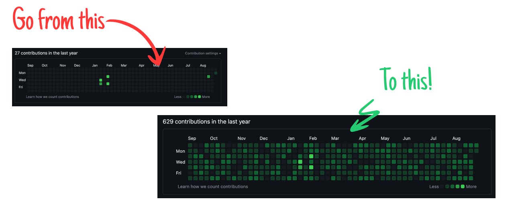

# Git History Generator


Because commit quantity is the only true measure of a developer

[Get it on GitHub](https://github.com/nk8/githistorygenerator)

## What's Git History Generator all about?

Ever noticed how some developers treat their GitHub contribution graph like a competitive sport? We think that's pretty funny, so we created Git History Generator to poke a little fun at the whole situation.

This project is a playful reminder that those green squares don't always tell the whole story. After all, we can make our contribution graph look impressive without writing a single line of meaningful code!

Don't let a graph dictate your worth as a developer. But if you must, we've got you covered!


## How it works



Git History Generator uses a shell script to generate fake Git commits and push them to your repository. It creates a "worklog.md" file and fills it with random entries, dating them back for the number of months you specify.

The script simulates a realistic commit pattern, making more commits on weekdays and fewer on weekends. It also varies the number of commits per day to make the contribution graph look more natural. Because who doesn't work harder on Mondays, right?

## Getting started

1. Clone Git History Generator:
   ```
   git clone https://github.com/nk8/githistorygenerator.git
   ```

2. Create a new repository on GitHub for your soon-to-be-impressive project

3. Navigate to the Git History Generator directory:
   ```
   cd githistorygenerator
   ```

4. Clone your new repository here:
   ```
   git clone [your-repo-url] [your-repo-name]
   ```

5. Run the magic script:
   ```
   ./script.sh -d [your-repo-name] -m [number_of_months]
   ```
   Replace [your-repo-name] with your target repo and [number_of_months] with how far back you want to pretend you've been coding.

6. Push your newly generated "hard work" to GitHub:
   ```
   cd [your-repo-name]
   git push
   ```

7. Marvel at your GitHub profile and bask in the glory of your green squares!

**Note:** The Git History Generator script files should remain separate from your target repository. You're running the script on your target repo, not copying the script into it. We wouldn't want anyone to know your secret, would we?

Remember, this is just for fun. We don't recommend using this for any serious purposes. Unless you're trying to impress your cat. Cats love green squares.

## Support Git History Generator

Enjoy using Git History Generator? Consider buying me a coffee to fuel more fun projects!

[](https://www.buymeacoffee.com/narekk)

## Share this on X

Found Git History Generator enlightening? Share the secret of true developer productivity!

> Just discovered Git History Generator - because nothing says "10x developer" like a fully tiled contribution graph! 💻✨ Check it out at GitHistoryGenerator.com #GitHistoryGenerator #DeveloperProductivity

[Share on X](https://twitter.com/intent/tweet?text=Just%20discovered%20Git%20History%20Generator%20-%20because%20nothing%20says%20%2210x%20developer%22%20like%20a%20fully%20tiled%20contribution%20graph!%20💻✨%20Check%20it%20out%20at%20GitHistoryGenerator.com%20%23GitHistoryGenerator%20%23DeveloperProductivity)

---

© 2024 Git History Generator. Made with 💚 and a healthy dose of humor by [@narekk](https://x.com/narekk).

[Follow @narekk on X](https://twitter.com/intent/follow?screen_name=narekk)